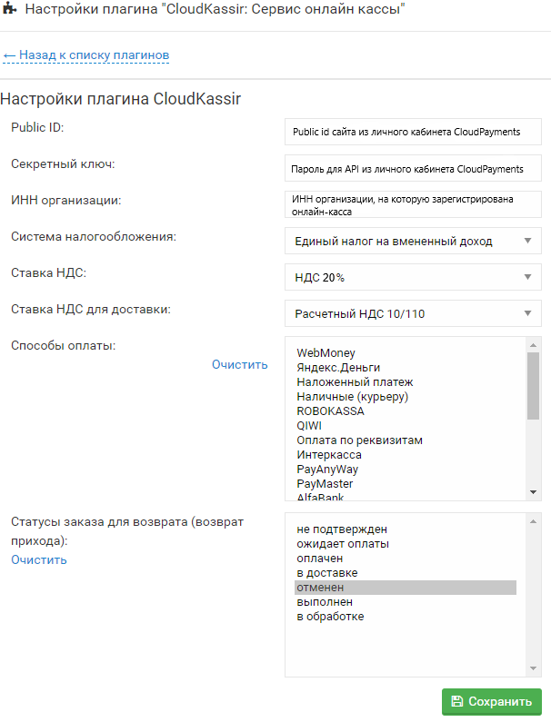

# CMS-Moguta-CK

Сервис [CloudKassir](https://cloudkassir.ru) предоставляет в аренду онлайн-кассы для Вашего интернет-магазина на платформе Moguta-CMS в соответствии требованиям ФЗ-54.  
Для корректной работы плагина необходима регистрация в сервисе.
Порядок регистрации описан в [документации CloudKassir](https://cloudkassir.ru/#subscribe).

## Совместимость:
Начиная с версии [релиза Moguta.CMS 8.0](https://moguta.ru/blog/istoriya-versiy/reliz-moguta-cms-8-0) установка не требуется, плагин уже предустановлен.

### Параметры модуля CloudKassir

Плагины -> CloudKassir: Сервис онлайн кассы:

* **Public_id** - Public id сайта из личного кабинета CloudPayments;
* **Секретный** ключ - Пароль для API из личного кабинета CloudPayments;
* **ИНН организации** - ИНН организации, на которую зарегистрирована онлайн-касса;
* **Система налогообложения** - Тип системы налогообложения. Возможные значения перечислены в [документации CloudPayments](https://cloudpayments.ru/Docs/Directory#taxation-system);
* **Ставка НДС** - Укажите ставку НДС. Все возможные значения указаны в документации
[документации CloudPayments](https://cloudpayments.ru/wiki/integration/instrumenti/spravochniki#taxation_system);
* **Ставка НДС для доставки** - Укажите отдельную ставку НДС для доставки. Если доставка платная, то она в чеке оформляется отдельной строкой со своей ставкой НДС. Значения аналогично ставке НДС для товаров;
* **Способ оплаты** - Выбирите способы оплаты, для которых требуется пробивать чек;
* **Статусы заказа для возврата** - Укажите, какой статус присваивать заказу после возврата средств на счет покупателя.

Затем сохранить введенные параметры.
